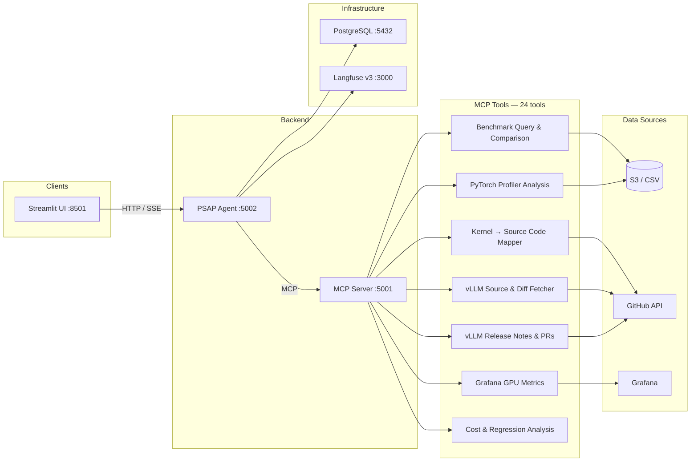

# PSAP AI Agent

An AI-powered performance analysis platform for [vLLM](https://github.com/vllm-project/vllm) inference benchmarking. It combines a LangGraph agent with a Model Context Protocol (MCP) server to query benchmark data, compare configurations and versions, analyze PyTorch profiler traces at the kernel level, cross-reference vLLM source code changes, and generate Grafana dashboard links -- all through natural language.

## Architecture



**PSAP Agent** — LangGraph-based agent powered by Google Gemini. Handles multi-turn conversations with streaming responses (SSE) and thread persistence. Traces are sent to Langfuse for observability.

**MCP Server** — FastMCP server exposing 24 performance analysis tools over the Model Context Protocol. Tools query benchmark data from S3/CSV, parse PyTorch profiler traces, fetch vLLM source code and diffs from GitHub, compare versions, and generate Grafana links.

**Streamlit UI** — Web interface for interacting with the agent. Supports multi-turn conversations with feedback buttons.

### PostgreSQL

PostgreSQL serves as the **conversation persistence layer**. In production, the agent uses LangGraph's `AsyncPostgresSaver` as both the checkpointer and store, which means:

- **Thread state** — Every conversation thread's full message history (human messages, AI responses, tool calls, tool results) is checkpointed to PostgreSQL after each interaction. This allows users to resume conversations across sessions.
- **Interrupt recovery** — If the agent is interrupted mid-tool-call, the checkpointed state lets it resume from where it left off.

For local development, an in-memory saver (`InMemorySaver`) can be used instead by setting `USE_INMEMORY_SAVER=true`, which avoids the need for a running PostgreSQL instance.

### Langfuse

[Langfuse](https://langfuse.com/) provides **LLM observability and tracing** for every agent interaction. The agent initializes a Langfuse `CallbackHandler` that is attached to every LangGraph invocation via `RunnableConfig.callbacks`. This captures:

- **Full trace of each conversation turn** — the LLM prompt, model response, token usage, and latency.
- **Tool call traces** — which MCP tools were called, with what arguments, and what they returned.
- **Session and user tracking** — traces are tagged with `session_id`, `user_id`, and `thread_id` so you can follow a user's conversation across multiple turns in the Langfuse dashboard.

The Langfuse stack (ClickHouse, Redis, MinIO, Worker, Web) is deployed alongside the agent. In the OpenShift deployment this is 5 pods; locally it runs via Podman containers.

## MCP Tool Catalog

| Category | Tools | Description |
|---|---|---|
| Benchmark Data | `query_performance_metrics`, `compare_configurations`, `compare_versions_comprehensive` | Query and compare throughput, latency, TTFT, ITL across models, accelerators, versions, and concurrency levels |
| Discovery | `get_dataset_metadata`, `discover_configurations` | Discover available models, accelerators, profiles, versions, and what was actually tested |
| Cost & Regression | `calculate_cost_efficiency`, `analyze_regression` | Cost-per-million-tokens analysis and version-to-version regression detection |
| Grafana | `query_grafana_metrics`, `compare_grafana_metrics`, `generate_grafana_url` | Query GPU/vLLM metrics from Grafana, compare runs, generate dashboard URLs |
| Dashboard | `generate_dashboard_url` | Generate links to the performance dashboard with pre-applied filters |
| PyTorch Profiler | `analyze_pytorch_profile`, `compare_pytorch_profiles`, `analyze_performance_insights`, `list_available_profiles`, `check_profile_status` | Parse Chrome trace JSON from S3, extract kernel stats, compare across versions with functional pipeline breakdowns, detect kernel fusion |
| Kernel ↔ Code | `map_kernel_to_vllm_code`, `get_kernel_categories`, `correlate_kernel_with_changes` | Map profiler kernel names to vLLM source files, categorize kernels, correlate performance changes with code changes |
| vLLM Source | `fetch_vllm_source`, `get_vllm_code_diff` | Fetch actual vLLM source code at any version tag and retrieve line-level diffs between versions via the GitHub API |
| vLLM Releases | `get_vllm_release_notes`, `compare_vllm_versions`, `get_version_mappings`, `get_vllm_pull_request` | Fetch release notes, compare changelogs, resolve version mappings, inspect specific PRs |

## Repository Structure

```
.
├── psap-agent/                 # LangGraph agent (Google Gemini)
│   ├── psap_agent/src/         #   Agent core (prompt, routes, settings)
│   ├── examples/               #   Streamlit UI app
│   ├── Containerfile           #   UBI9 Python 3.12 container image
│   ├── .env.example            #   Agent-specific env vars
│   └── README.md
├── psap-mcp-server/            # FastMCP server with 24 analysis tools
│   ├── psap_mcp_server/src/    #   Tool implementations, MCP registration
│   │   └── tools/              #   One module per tool category
│   ├── Containerfile           #   UBI9 Python 3.12 container image
│   ├── .env.example            #   MCP server-specific env vars
│   └── README.md
├── scripts/
│   └── upload-profiles-to-s3.sh  # Upload PyTorch profiler traces to S3
├── openshift-manifests/        # OpenShift/K8s deployment (9 pods)
│   ├── 01-secrets.yaml         #   Secrets (PostgreSQL, Langfuse, Grafana, S3)
│   ├── 02-postgresql.yaml      #   PostgreSQL + PVC
│   ├── 03-langfuse.yaml        #   Langfuse v3 (ClickHouse, Redis, MinIO, Worker, Web)
│   ├── 04-mcp-server.yaml      #   MCP Server deployment
│   ├── 05-agent.yaml           #   Agent deployment
│   ├── 06-streamlit.yaml       #   Streamlit UI deployment
│   ├── BUILD_AND_PUSH.sh       #   Build & push images to Quay
│   └── DEPLOY_GUIDE.md         #   Step-by-step deployment guide
├── docs/                       # Additional deployment and architecture guides
├── consolidated_dashboard.csv  # Benchmark data (local fallback for S3)
├── test-local-containers.sh    # Local dev: full stack in Podman
├── .env.example                # Infrastructure credentials template
└── .gitignore
```

## Quick Start (Local Development)

### Prerequisites

- [Podman](https://podman.io/) installed
- A Google Gemini API key
- (Optional) AWS credentials for S3 access to benchmark data and profiler traces

### 1. Configure environment

```bash
cp .env.example .env
# Edit .env with your PostgreSQL and Langfuse infrastructure passwords
```

Each component also has its own `.env.example` for standalone development:
- `psap-agent/.env.example` — Langfuse API keys, Google credentials, agent ports
- `psap-mcp-server/.env.example` — Grafana credentials, MCP server ports, S3 config

### 2. Run the full stack

```bash
./test-local-containers.sh
```

This starts PostgreSQL, the Langfuse v3 stack (ClickHouse, Redis, MinIO, Worker, Web), the MCP Server, the Agent, and the Streamlit UI.

### 3. Open the UI

Navigate to [http://localhost:8501](http://localhost:8501) and start asking questions:

- *"Compare vLLM 0.13.0 vs 0.11.2 for DeepSeek on H200"*
- *"What's the throughput for Llama-3.1-70B at concurrency 64?"*
- *"Analyze the PyTorch profiler traces for DeepSeek and tell me why 0.13.0 is faster"*
- *"Show me the code diff for fused_moe between v0.11.2 and v0.13.0"*
- *"What changed in the vLLM 0.13.0 release notes related to MoE?"*

### Useful commands

```bash
./test-local-containers.sh rebuild   # Rebuild images after code changes
./test-local-containers.sh restart   # Restart containers without rebuilding
podman logs -f psap-agent            # Stream agent logs
podman logs -f psap-mcp-server       # Stream MCP server logs
```

## OpenShift Deployment

See [openshift-manifests/DEPLOY_GUIDE.md](openshift-manifests/DEPLOY_GUIDE.md) for a step-by-step guide to deploy the full stack on OpenShift.

The manifests deploy 9 pods: PostgreSQL, ClickHouse, Redis, MinIO, Langfuse Worker, Langfuse Web, MCP Server, Agent, and Streamlit UI.

## Uploading Profiler Traces

The PyTorch profiler tools expect Chrome trace JSON files in S3 under a specific layout:

```
s3://<bucket>/profiles/rhaiis/<model>/<version>/trace_rank<N>_*.json
```

Use the helper script to upload:

```bash
./scripts/upload-profiles-to-s3.sh <local-traces-dir> <model> <version>
```

See [scripts/README.md](scripts/README.md) for details on the expected directory structure and S3 layout.

## Component Documentation

- [psap-agent/README.md](psap-agent/README.md) — Agent architecture, API endpoints, configuration
- [psap-mcp-server/README.md](psap-mcp-server/README.md) — MCP server architecture, tool catalog, development guide

## License

[Apache 2.0](psap-agent/LICENSE)
