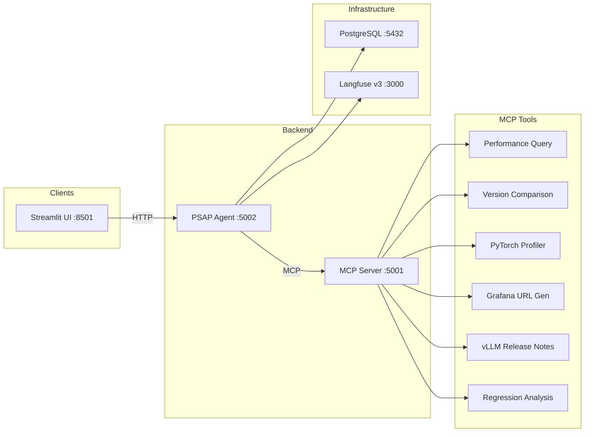

# PSAP AI Agent

An AI-powered performance analysis platform for [vLLM](https://github.com/vllm-project/vllm) benchmarking. It combines an LLM agent with a Model Context Protocol (MCP) server to query performance data, compare benchmark results, analyze PyTorch profiler traces, and generate Grafana dashboard links -- all through natural language.

## Architecture



**PSAP Agent** -- LangGraph-based agent using Google Gemini. Handles conversations, streaming responses, and thread management. Traces are sent to Langfuse for observability.

**MCP Server** -- FastMCP server exposing performance analysis tools over the Model Context Protocol. Tools query benchmark data from S3/CSV, analyze PyTorch profiler traces, compare versions, and generate Grafana links.

**Streamlit UI** -- Web interface for interacting with the agent. Supports multi-turn conversations with feedback buttons.

## Repository Structure

```
.
├── psap-agent/                 # LangGraph agent (Google Gemini)
│   ├── psap_agent/src/         #   Agent core, routes, settings
│   ├── examples/               #   Streamlit UI app
│   ├── .env.example            #   Agent-specific env vars
│   └── README.md
├── psap-mcp-server/            # FastMCP server with analysis tools
│   ├── psap_mcp_server/src/    #   Tools, MCP registration, settings
│   ├── .env.example            #   MCP server-specific env vars
│   └── README.md
├── openshift-manifests/        # OpenShift/K8s deployment templates
│   ├── 01-secrets.yaml         #   Secrets (3 resources)
│   ├── 02-postgresql.yaml      #   PostgreSQL + PVC
│   ├── 03-langfuse.yaml        #   Langfuse v3 full stack (5 pods)
│   ├── 04-mcp-server.yaml      #   MCP Server deployment
│   ├── 05-agent.yaml           #   Agent deployment
│   ├── 06-streamlit.yaml       #   Streamlit UI deployment
│   └── DEPLOY_GUIDE.md         #   Step-by-step deployment guide
├── docs/                       # Archived deployment guides (v2-era)
├── test-local-containers.sh    # Local dev: runs everything in Podman
├── .env.example                # Infrastructure credentials template
└── .gitignore
```

## Quick Start (Local Development)

### Prerequisites

- [Podman](https://podman.io/) installed
- A Google Gemini API key

### 1. Configure environment

```bash
cp .env.example .env
# Edit .env with your PostgreSQL and Langfuse infrastructure passwords
```

Each component also has its own `.env.example` for standalone development:
- `psap-agent/.env.example` -- Langfuse API keys, Google credentials, agent ports
- `psap-mcp-server/.env.example` -- Grafana credentials, MCP server ports, S3 config

### 2. Run the full stack

```bash
./test-local-containers.sh
```

This starts PostgreSQL, the Langfuse v3 stack (ClickHouse, Redis, MinIO, Worker, Web), the MCP Server, the Agent, and the Streamlit UI.

### 3. Open the UI

Navigate to [http://localhost:8501](http://localhost:8501) and start asking questions:

- *"Compare vLLM 0.13.0 vs 0.11.2 for DeepSeek on H200"*
- *"Show me throughput for Llama-3.1-70B"*
- *"Analyze the PyTorch profiler traces for GPT-OSS"*

### Useful commands

```bash
./test-local-containers.sh rebuild   # Rebuild images after code changes
./test-local-containers.sh restart   # Restart containers without rebuilding
podman logs -f psap-agent            # Stream agent logs
podman logs -f psap-mcp-server       # Stream MCP server logs
```

## OpenShift Deployment

See [openshift-manifests/DEPLOY_GUIDE.md](openshift-manifests/DEPLOY_GUIDE.md) for a step-by-step guide to deploy the full stack on OpenShift.

The manifests deploy 9 pods: PostgreSQL, ClickHouse, Redis, MinIO, Langfuse Worker, Langfuse Web, MCP Server, Agent, and Streamlit UI.

## Component Documentation

- [psap-agent/README.md](psap-agent/README.md) -- Agent architecture, API endpoints, configuration
- [psap-mcp-server/README.md](psap-mcp-server/README.md) -- MCP server architecture, tool catalog, development guide

## License

[Apache 2.0](psap-agent/LICENSE)
