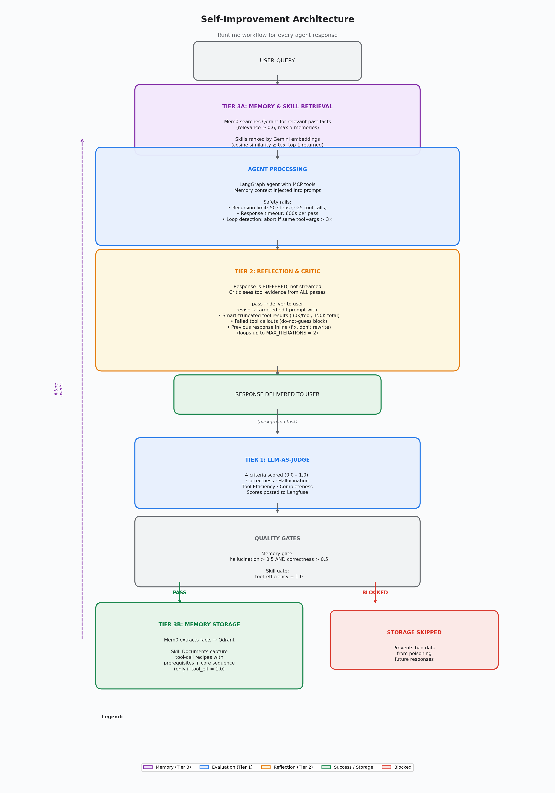

# Self-Improvement Architecture

This document describes the agent's self-improvement system: automated evaluation, quality-gated memory, inline reflection, and runtime safety mechanisms. These features work together to make the agent more accurate over time, prevent incorrect information from propagating, and protect against runaway execution.

## Table of Contents

1. [Overview](#overview)
2. [System Architecture](#system-architecture)
3. [Tier 1: LLM-as-Judge Evaluation](#tier-1-llm-as-judge-evaluation)
4. [Tier 2: Reflection & Critic Node](#tier-2-reflection--critic-node)
5. [Tier 3: Long-Term Memory](#tier-3-long-term-memory)
6. [Quality-Gated Memory Storage](#quality-gated-memory-storage)
7. [Safety Mechanisms](#safety-mechanisms)
8. [Configuration Reference](#configuration-reference)
9. [Operational Guide](#operational-guide)

---

## Overview



The self-improvement system is organized into three tiers that run after every agent response, wrapped in runtime safety mechanisms that prevent runaway execution:

```
                          ┌──────────────────┐
                          │   USER QUERY     │
                          └────────┬─────────┘
                                   │
                                   ▼
                ┌──────────────────────────────────────┐
                │  TIER 3A: MEMORY RETRIEVAL            │
                │  Mem0 searches Qdrant for relevant    │
                │  past facts (relevance ≥ 0.6, max 5) │
                │                                      │
                │  Skills ranked by Gemini embeddings   │
                │  (cosine sim ≥ 0.5, top 1 returned)  │
                └────────────────┬─────────────────────┘
                                 │
                                 ▼
          ┌──────────────────────────────────────────────────┐
          │  AGENT PROCESSING                                 │
          │  LangGraph agent with MCP tools                   │
          │  Memory context injected into prompt              │
          │                                                   │
          │  Safety rails:                                    │
          │  • Recursion limit: 50 steps (~25 tool calls max) │
          │  • Response timeout: 600s per pass                │
          │  • Loop detection: aborts if same tool+args > 3x  │
          └────────────────┬─────────────────────────────────┘
                                 │
                                 ▼
                ┌──────────────────────────────────────┐
                │  TIER 2: REFLECTION (before delivery) │
                │  Response is BUFFERED, not streamed   │
                │  Critic checks for hallucinated URLs, │
                │  unsupported claims, missing evidence  │
                │  Critic sees tool evidence from ALL   │
                │  passes (not just current)            │
                │                                       │
                │  pass ──► deliver to user              │
                │  revise ──► targeted edit prompt with  │
                │    • previous response inline          │
                │    • smart-truncated tool results      │
                │    • failed tool callouts              │
                │    (loops up to MAX_ITERS=2)           │
                └────────────────┬─────────────────────┘
                                 │
                                 ▼
                ┌──────────────────────────────────────┐
                │  RESPONSE DELIVERED TO USER           │
                │  (only the final, approved response)  │
                └────────────────┬─────────────────────┘
                                 │
                        (background task)
                                 │
                                 ▼
                ┌──────────────────────────────────────┐
                │  TIER 1: LLM-AS-JUDGE                 │
                │  4 criteria scored (0.0 – 1.0):       │
                │    Correctness · Hallucination         │
                │    Tool Efficiency · Completeness      │
                │  Scores posted to Langfuse             │
                └────────────────┬─────────────────────┘
                                 │
                                 ▼
                ┌──────────────────────────────────────┐
                │  QUALITY GATES                        │
                │                                      │
                │  Memory gate:                        │
                │    hallucination > 0.5?              │
                │    correctness > 0.5?                │
                │                                      │
                │  Skill gate:                         │
                │    tool_efficiency = 1.0?            │
                └───────┬──────────────────┬───────────┘
                        │                  │
                   PASS (safe)        BLOCKED
                        │                  │
                        ▼                  ▼
         ┌─────────────────────┐  ┌────────────────────┐
         │ TIER 3B: MEMORY     │  │ STORAGE SKIPPED    │
         │ STORAGE             │  │ Prevents bad data  │
         │                     │  │ from poisoning     │
         │ Mem0 extracts facts │  │ future responses   │
         │ → Qdrant vector DB  │  └────────────────────┘
         │                     │
         │ Skill Documents     │
         │ (only if tool_eff   │
         │  = 1.0)             │
         └─────────┬───────────┘
                   :
                   : (future queries)
                   :
                   ▼
           Back to MEMORY RETRIEVAL
```

---

## System Architecture

### Data Flow: Full Request Lifecycle

```
  User sends message
        │
        ▼
  ┌─────────────┐     ┌──────────────────────┐
  │  Manager     │────►│  Mem0: Retrieve       │
  │  _handle_    │     │  relevant memories    │
  │  input()     │◄────│  (threshold ≥ 0.6,    │
  │              │     │   max 5 results)      │
  │              │     │                       │
  │              │────►│  Skills: fetch all,   │
  │              │◄────│  rank by embedding    │
  │              │     │  similarity (top 1,   │
  │              │     │  threshold ≥ 0.5)     │
  └──────┬──────┘     └──────────────────────┘
         │
         │  Injects memory context into HumanMessage:
         │  "user query\n\n[SYSTEM - Memory Context ...]\n..."
         │
         ▼
  ┌─────────────────────────────────────────────────┐
  │  LangGraph Agent (with safety rails)             │
  │  ◄──── MCP Tools                                │
  │                                                  │
  │  • recursion_limit=50 (≈25 tool calls max)      │
  │  • asyncio.timeout(600s) per pass               │
  │  • tool-call loop detection (>3 identical = abort)│
  │  (streaming, buffered until critic approves)     │
  └──────┬───────────────────────────────────────────┘
         │
         │  collected_messages (tool calls + AI responses)
         │  all_tool_messages (accumulated across ALL passes)
         │
         ├──────────────────────────────────┐
         │                                  │
         ▼                                  ▼
  ┌───────────────────┐            ┌──────────────────────────┐
  │ Tier 2: Critic    │            │ _post_process()          │
  │ (inline, buffered)│            │ (background task)        │
  │                   │            │                          │
  │ Sees tool msgs    │            │  1. Flush Langfuse       │
  │ from ALL passes   │            │  2. Resolve trace ID     │
  │                   │            │  3. Run LLM Judge        │
  │ Pass ──► deliver  │            │  4. Memory gate          │
  │ Revise ──►        │            │     (halluc > 0.5 AND    │
  │  targeted edit    │            │      correct > 0.5)      │
  │  with smart-      │            │  5. Store memory         │
  │  truncated tool   │            │  6. Skill gate           │
  │  results inline   │            │     (tool_eff = 1.0)     │
  └───────────────────┘            │  7. Generate skill doc   │
                                   └──────────────────────────┘
```

### File Map

| File | Purpose |
|------|---------|
| `psap_agent/src/core/evaluator.py` | LLM-as-Judge: scoring, rubrics, JSON retry, memory gate |
| `psap_agent/src/core/reflection.py` | Critic node: inline response review before user sees it |
| `psap_agent/src/core/memory.py` | Mem0 integration, Skill Documents, MemoryManager |
| `psap_agent/src/core/manager.py` | Orchestration: injects memory, runs eval, gates storage, smart truncation |
| `psap_agent/src/core/agent.py` | Agent initialization: model selection, store setup, recursion limits |
| `psap_agent/src/settings.py` | Configuration: feature flags, model names, thresholds |

---

## Tier 1: LLM-as-Judge Evaluation

Automated scoring of every agent response across four criteria, running as a background task after the response is streamed to the user.

### Criteria & Rubrics

| Criterion | What it measures | Score 1.0 | Score 0.5 | Score 0.0 |
|-----------|-----------------|-----------|-----------|-----------|
| **Correctness** | Accuracy based on tool outputs and memory | Data directly from tools/memory | Partially correct | Fabricated data |
| **Hallucination** | Fabrication of URLs, metrics, or data | All data traceable to tools/memory | Minor embellishment | Invented data |
| **Tool Efficiency** | Minimum necessary tool usage | Only necessary tools used (discovery/listing calls count as necessary) | 1–2 unnecessary calls | Many redundant calls |
| **Completeness** | All parts of query addressed | Fully addressed | Most parts covered | Significant gaps |

### How It Works

```
  collected_messages
        │
        ▼
  _extract_conversation_parts()
        │
        ├──► user_query (stripped of memory context marker)
        ├──► agent_response (last AI message)
        ├──► full_summary (CALL/RESULT pairs, linked by tool_call_id)
        ├──► calls_only (just tool names + args, no results)
        └──► memory_context (extracted from [SYSTEM - Memory Context ...])
              │
              ▼
  ┌───────────────────────────────────────────────────┐
  │  4 parallel _run_single_eval() calls              │
  │                                                   │
  │  correctness   ──► full_summary + memory_context  │
  │  hallucination ──► full_summary + memory_context  │
  │  tool_efficiency ──► calls_only (names only)      │
  │  completeness    ──► calls_only (names only)      │
  │                                                   │
  │  Each uses Gemini Flash as judge (temperature=0)  │
  └───────────────────────────────────────────────────┘
        │
        ▼
  Scores posted to Langfuse via create_score()
  Token usage appended to score comment
```

### Key Design Decisions

- **Paired CALL/RESULT format**: Each tool call is matched with its specific result using `tool_call_id`. This prevents the judge from confusing which result belongs to which call when the agent makes many parallel tool calls.

- **Criterion-specific context**: `correctness` and `hallucination` receive the full tool outputs (up to 10K chars per result). `tool_efficiency` and `completeness` only receive tool names and arguments — they don't need the full results, which reduces token cost and noise.

- **Memory-aware rubrics**: The judge receives memory context as a separate labeled section and the rubrics explicitly state that data from memory is a valid source, not fabrication.

- **JSON retry**: If the judge returns malformed JSON, its bad response is fed back with a nudge to produce valid JSON, giving it a second attempt before failing.

- **Score clamping**: Scores are clamped to `[0.0, 1.0]` before being written to Langfuse.

- **Transient failure retry**: Network errors or rate limits trigger a 3-second delay and retry.

---

## Tier 2: Reflection & Critic Node

An inline quality check that reviews the agent's response **before** it reaches the user. Unlike the LLM-as-Judge (which runs in the background after delivery), the critic can block delivery and trigger targeted edits in real time.

### What the Critic Checks

1. **Hallucinated URLs** — Any URL not returned by a tool call
2. **Unsupported claims** — Metrics or facts not backed by tool outputs
3. **Missing tool evidence** — Claims that should have tool calls but don't
4. **Incomplete response** — Parts of the user's question left unanswered

### Architecture: Revision Loop

The response is **buffered, not streamed**, until the critic approves it. If the critic finds issues, the agent re-runs with a structured revision prompt that includes the previous response and all tool results. The user only sees the final, approved response.

```
  Agent generates response (buffered, not shown to user)
        │
        │  Critic receives:
        │  • Current pass messages
        │  • Tool messages from ALL prior passes
        │    (merged by tool_call_id deduplication)
        │
        ├──► Programmatic URL check (regex-based, no LLM cost)
        │    Extracts URLs from response and tool outputs,
        │    flags any response URL not in tool outputs
        │
        └──► LLM Critic (Gemini Flash, temperature=0)
             Receives paired CALL/RESULT tool summary
             Returns JSON: { verdict, issues, revision_instructions }
                │
                ▼
        ┌───────────────┐
        │ verdict: pass │──► Response delivered to user
        └───────────────┘
        ┌────────────────┐
        │ verdict: revise│──► Targeted edit prompt built
        └────────────────┘
                │
                ▼
        Revision prompt includes:
        ┌─────────────────────────────────────────────────┐
        │ 1. Flagged issues list                          │
        │ 2. TOOL RESULTS (smart-truncated, all passes)   │
        │    • Per-tool limit: 30K chars                  │
        │    • Total budget: 150K chars                   │
        │    • JSON outputs: high-signal fields extracted │
        │ 3. FAILED TOOLS (separate block, do-not-guess)  │
        │ 4. YOUR PREVIOUS RESPONSE (up to 50K chars)     │
        │ 5. INSTRUCTIONS: edit, don't rewrite            │
        │    • Fix flagged claims only                    │
        │    • Remove unsupported claims entirely         │
        │    • Don't compute derived stats               │
        │    • Don't add new claims                      │
        └─────────────────────────────────────────────────┘
                │
                ▼
        New response generated (buffered, safety-checked)
        • If tool-call loop detected → abort, use previous
        • If no output produced → fallback to previous
                │
                ▼
        Loop back to critic (up to MAX_REFLECTION_ITERATIONS=2)
```

### Smart Truncation (`_smart_truncate_tool_result`)

When building the revision prompt, tool results are truncated intelligently rather than with a blind character cut:

1. If the tool output is valid JSON, high-signal fields are extracted first: `overall_verdict`, `verdict_explanation`, `summary`, `regressions`, `improvements`, `key_differences`, `status`, `message`, `suggestion`
2. Remaining budget is filled with raw detail from the full JSON
3. Non-JSON outputs fall back to simple character truncation
4. LangChain content wrappers (`[{"type":"text","text":"..."}]`) are unwrapped automatically

This ensures the revision model sees verdicts and summaries even when the full output exceeds the per-tool limit.

### Cross-Pass Tool Context

The critic and evaluator receive tool messages from **all** passes, not just the current one. This is critical because:
- Revisions may reuse tool results from the thread without re-calling tools
- Without cross-pass context, the evaluator would conclude "no tool calls made" and score hallucination=0
- Tool messages are merged by `tool_call_id` deduplication to avoid duplicates

**Key design decisions:**
- The user never sees an incorrect response — everything is buffered until approved
- `MAX_REFLECTION_ITERATIONS` (default: 2) caps the loop to prevent runaway revisions
- If the critic itself fails (LLM error), the current response is delivered as-is (fail-open)
- If the programmatic URL check finds issues but the LLM critic says "pass", the programmatic result overrides (forced "revise")
- Revision prompts instruct targeted edits (not full rewrites) to preserve correct content
- If a revision pass is aborted (loop detection or timeout), the previous response is used

---

## Tier 3: Long-Term Memory

Two complementary memory systems that help the agent learn from past interactions.

### 3A: Semantic/Episodic Memory (Mem0)

Mem0 automatically extracts facts from conversations and stores them as vector embeddings in Qdrant for semantic retrieval.

```
  ┌────────────────────────────────────────────────────────┐
  │                    Mem0 Stack                           │
  │                                                        │
  │  ┌──────────────┐   ┌──────────────┐   ┌───────────┐  │
  │  │ Gemini 2.5   │   │ Gemini       │   │ Qdrant    │  │
  │  │ Flash        │   │ Embedding    │   │ (on-disk) │  │
  │  │              │   │ 001          │   │           │  │
  │  │ Fact         │   │              │   │ 768-dim   │  │
  │  │ extraction   │   │ 768-dim      │   │ vectors   │  │
  │  │ from convos  │   │ embeddings   │   │           │  │
  │  └──────────────┘   └──────────────┘   └───────────┘  │
  └────────────────────────────────────────────────────────┘
```

**Retrieval filtering**:
- Semantic search returns candidates ranked by relevance score
- **Relevance threshold**: Only memories with score ≥ 0.6 are included (configurable via `_RELEVANCE_THRESHOLD`)
- **Hard cap**: Maximum 5 memories injected per query (configurable via `_MAX_MEMORIES`)
- Uses `top_k` parameter for open-source Mem0, `limit` for hosted API

**Storage**: Qdrant data is persisted via volume mounts:
- Local (Podman): `~/.psap-agent/qdrant:/app/qdrant_data`
- OpenShift: PersistentVolumeClaim `mem0-qdrant-data` (1Gi)

### 3B: Procedural Memory (Skill Documents)

When the agent completes a complex interaction AND the tool sequence is judged as optimal (`tool_efficiency = 1.0`), a Skill Document is generated — a reusable recipe for that type of investigation.

```json
{
  "title": "Cross-Version Performance Comparison",
  "trigger": "When comparing benchmark metrics, GPU utilization, and logs between two different software versions",
  "prerequisites": ["discover_configurations"],
  "tool_sequence": ["compare_configurations", "compare_grafana_metrics", "compare_vllm_logs", "generate_dashboard_url"],
  "notes": "The workflow begins by identifying the specific benchmark runs for the two versions being compared.",
  "tags": ["performance-analysis", "benchmarking", "regression-testing"],
  "created_at": "2026-05-18T18:08:27+00:00",
  "source_query": "Compare the performance of deepseek-ai/DeepSeek-R1-0528 between RHAIIS-3.3 and RHAIIS-3.4-EA1"
}
```

**Schema**: Skills separate discovery/setup tools from the core workflow:
- `prerequisites`: Tools that gather IDs, list available items, or resolve names into identifiers (e.g., `discover_configurations`). A consumer starting from scratch needs these first. Empty list if none are needed.
- `tool_sequence`: The core analysis/action tools that do the real work once IDs are known.

**Extraction**: Before sending tool calls to the extraction LLM, consecutive identical tool names are collapsed with a count annotation (e.g., `discover_configurations (x3 parallel)`). This gives the LLM a cleaner picture of what the agent actually did, without inflating repeated parallel calls.

**Complexity criteria** (must meet at least one):
- `≥ SKILL_GENERATION_THRESHOLD` tool calls (default: 5)
- Error recovery detected (errors followed by successful calls) AND `≥ 4` tool calls

**Error recovery detection**: Checks for `"status":"error"` in tool output content (not generic "error" substring matching). Requires both error results AND successful results after them, indicating the agent adapted its approach.

**Storage backends**:
- Production: `AsyncPostgresStore` (dedicated store, separate from the checkpoint, no pgvector required)
- Local development: `InMemoryStore`

**Retrieval — client-side semantic ranking**: Skills are not retrieved via database-level vector search (which would require pgvector). Instead, all skills are fetched from the store, then ranked client-side using Gemini embeddings (`gemini-embedding-001`, 768-dim) with cosine similarity against the user's query. Each skill is embedded on its `title + trigger + tags` fields. Only the top match is returned, and only if its similarity score exceeds `_SKILL_RELEVANCE_THRESHOLD` (0.5). This avoids adding pgvector as a dependency on both local and OpenShift Postgres instances.

**Rendering**: When a skill with prerequisites is injected into the agent's context, it renders as:

```
Prerequisites (run first if starting from scratch):
  1. discover_configurations
Core Tool Sequence:
  1. compare_configurations
  2. compare_grafana_metrics
  ...
```

Skills without prerequisites omit the "Prerequisites" section and label the sequence as "Tool Sequence:" instead.

### 3C: Memory Manager

The `MemoryManager` class coordinates both systems behind a single interface:

```
  get_memory_context(query, user_id)
        │
        ├──► Mem0: semantic search for relevant facts
        │    (filtered by relevance ≥ 0.6, max 5)
        │
        └──► Skills: fetch all from store, embed query + skills
             via Gemini embeddings, rank by cosine similarity,
             return top 1 if score ≥ 0.5
              │
              ▼
        Combined context string injected into system prompt
```

---

## Quality-Gated Memory Storage

The eval-then-store pipeline prevents incorrect responses from poisoning the memory. Memory storage and skill generation have **independent gates** — a response can pass the memory gate but fail the skill gate (or vice versa).

```
  Agent response delivered to user
        │
        ▼
  ┌─────────────────────────────────────┐
  │  STEP 1: LLM-as-Judge evaluation    │
  │                                     │
  │  Returns scores:                    │
  │  { correctness: 1.0,               │
  │    hallucination: 0.0,             │
  │    tool_efficiency: 0.5,           │
  │    completeness: 1.0 }            │
  └──────────────┬──────────────────────┘
                 │
                 ▼
  ┌─────────────────────────────────────┐
  │  STEP 2: should_store_memory()      │
  │                                     │
  │  Gate rules:                        │
  │  • hallucination must be > 0.5      │
  │  • correctness must be > 0.5        │
  │  • If eval disabled/failed ──► PASS │
  │                                     │
  │  In this example:                   │
  │  hallucination = 0.0 ──► BLOCKED    │
  └──────────────┬──────────────────────┘
                 │
                 ▼
  ┌─────────────────────────────────────┐
  │  STEP 3: Conditional memory storage │
  │                                     │
  │  PASS ──► Mem0 stores interaction   │
  │  BLOCKED ──► Log warning, skip      │
  └──────────────┬──────────────────────┘
                 │
                 ▼
  ┌─────────────────────────────────────┐
  │  STEP 4: Skill generation gate      │
  │  (independent of memory gate)       │
  │                                     │
  │  Gate rule:                         │
  │  • tool_efficiency must be = 1.0    │
  │                                     │
  │  Rationale: Skill docs capture      │
  │  tool-call recipes, not response    │
  │  content. Only store recipes where  │
  │  the tool sequence was optimal.     │
  │                                     │
  │  PASS ──► maybe_generate_skill()    │
  │  BLOCKED ──► Log info, skip         │
  └─────────────────────────────────────┘
```

This prevents two feedback loops:
1. **Memory poisoning**: Wrong answers stored as facts → injected into future queries → agent repeats mistakes
2. **Skill pollution**: Suboptimal tool sequences stored as recipes → agent follows inefficient patterns

---

## Safety Mechanisms

Three runtime safety mechanisms prevent the agent from consuming unbounded resources:

### 1. Recursion Limit

```python
_RECURSION_LIMIT = 50  # in agent.py
```

Each LangGraph "step" is one node invocation (LLM call or tool execution). A single tool-use round-trip = 2 steps (LLM decides + tool runs). 50 steps ≈ 25 tool calls max, which is generous for any legitimate query but prevents infinite loops.

Applied via `.with_config(recursion_limit=_RECURSION_LIMIT)` on every agent instance.

### 2. Response Timeout

```python
AGENT_RESPONSE_TIMEOUT_SECONDS = 600  # configurable via env var
```

Each agent pass (initial run or revision) is wrapped in `asyncio.timeout()`. If the agent exceeds 600 seconds on a single pass, the pass is aborted and treated as if it produced no output. For revision passes, the previous (pre-revision) response is used as a fallback.

### 3. Tool-Call Loop Detection

```python
_MAX_DUPLICATE_TOOL_CALLS = 3  # in manager.py
```

Tracks each `(tool_name, args)` signature during a pass. If the same tool is called with identical arguments more than 3 times, the pass is immediately aborted. This catches scenarios where the agent is stuck in a retry loop (e.g., repeatedly calling a failing tool with the same parameters).

When a loop is detected:
- The pass is marked as `aborted`
- A warning status event is emitted to the client
- For the initial pass: the partial response is delivered (if any)
- For revision passes: the previous response is used as fallback
- Reflection is disabled for aborted initial passes

---

## Configuration Reference

All settings are in `psap_agent/src/settings.py` and can be overridden via environment variables.

### Feature Flags

| Setting | Default | Description |
|---------|---------|-------------|
| `ENABLE_LLM_JUDGE` | `True` | Enable/disable LLM-as-Judge evaluation |
| `ENABLE_REFLECTION` | `True` | Enable/disable the critic node |
| `ENABLE_MEM0` | `True` | Enable/disable Mem0 memory |
| `ENABLE_SKILL_DOCUMENTS` | `True` | Enable/disable skill document generation |

### Model & Thresholds

| Setting | Default | Description |
|---------|---------|-------------|
| `LLM_JUDGE_MODEL` | `gemini-3-flash-preview` | Model used for judge, critic, and skill extraction |
| `MAX_REFLECTION_ITERATIONS` | `2` | Max revision loops before delivering response |
| `AGENT_RESPONSE_TIMEOUT_SECONDS` | `600` | Timeout per agent pass (seconds) |
| `MEM0_QDRANT_PATH` | `/app/qdrant_data` | Qdrant storage path inside container |
| `SKILL_GENERATION_THRESHOLD` | `5` | Min tool calls to trigger skill extraction |

### Hardcoded Thresholds (in code)

| Constant | File | Value | Purpose |
|----------|------|-------|---------|
| `_RECURSION_LIMIT` | `agent.py` | `50` | Max LangGraph steps per invocation |
| `_MAX_DUPLICATE_TOOL_CALLS` | `manager.py` | `3` | Max identical tool calls before abort |
| `_PER_TOOL_LIMIT` | `manager.py` | `30000` | Max chars per tool result in revision prompt |
| `_TOTAL_BUDGET` | `manager.py` | `150000` | Max total chars for all tool results in revision |
| `_RELEVANCE_THRESHOLD` | `memory.py` | `0.6` | Min Mem0 relevance score for retrieval |
| `_MAX_MEMORIES` | `memory.py` | `5` | Max memories injected per query |
| `_SKILL_RELEVANCE_THRESHOLD` | `memory.py` | `0.5` | Min cosine similarity for skill retrieval |
| `_MEMORY_GATE_THRESHOLD` | `evaluator.py` | `0.5` | Min score to allow memory storage |
| Skill gate threshold | `manager.py` | `1.0` | Min tool_efficiency to allow skill generation |
| `_MAX_RETRIES` | `evaluator.py` | `2` | Judge retry attempts |
| `_RETRY_DELAY_SECS` | `evaluator.py` | `3.0` | Delay between retries |

---

## Operational Guide

### Viewing Scores in Langfuse

Each agent response produces 4 scores visible in the Langfuse trace:
- `llm-judge-correctness`
- `llm-judge-hallucination`
- `llm-judge-tool_efficiency`
- `llm-judge-completeness`

Each score's comment includes the judge's reasoning and token usage (e.g., `[tokens: 1655 in / 2021 out]`).

### Clearing Memory

Use the test script to clear Qdrant data:

```bash
./test-local-containers.sh clear-memory              # Both prod + staging
./test-local-containers.sh clear-memory staging       # Staging only
./test-local-containers.sh clear-memory prod          # Production only
```

Restart the agent containers after clearing for the change to take effect.

### Debugging Memory Issues

Check agent logs for memory-related messages:

```bash
podman logs psap-agent-staging 2>&1 | grep -i "mem0\|memory gate\|Skipping memory\|Skill generation"
```

Key log messages:
- `Mem0: retrieved 3/10 memories (threshold=0.6)` — 3 of 10 candidates passed the relevance filter
- `Mem0: skipping memory (score=0.35): ...` — individual memory filtered out (debug level)
- `Memory gate: BLOCKED (hallucination=0.0)` — eval prevented storage
- `Skipping memory storage due to low eval scores: {...}` — full scores shown
- `Skill retrieval: using 'Cross-Version Performance Comparison' (score=0.81)` — skill matched and injected
- `Skill retrieval: skipping 'Model Startup Analysis' (score=0.35 < 0.5)` — skill filtered out (debug level)
- `Skill generation gate passed (tool_efficiency=1.0)` — skill doc will be generated
- `Skill generation skipped (tool_efficiency=0.5)` — tool sequence wasn't optimal
- `Complex interaction detected (6 tool calls, error_recovery=False). Generating skill document.` — extraction triggered
- `Stored skill document: Cross-Version Performance Comparison` — skill persisted
- `Skill generation: not complex enough (tool_calls=3, threshold=5, error_recovery=False)` — interaction too simple

### Debugging Safety Mechanisms

```bash
podman logs psap-agent-staging 2>&1 | grep -i "loop detected\|timed out\|aborted"
```

Key log messages:
- `Tool-call loop detected: <tool_name> called 4 times with same args. Aborting pass.` — loop detection fired
- `Agent pass timed out after 600s` — timeout triggered
- `Revision N aborted due to tool-call loop, using previous response` — revision fallback
- `Merging N tool messages from prior passes into eval context` — cross-pass context for evaluator

### Persistence

**Mem0 / Qdrant (vector memory)**:

| Environment | Storage | Path |
|-------------|---------|------|
| Local (Podman) — prod | Host volume | `~/.psap-agent/qdrant` |
| Local (Podman) — staging | Host volume | `~/.psap-agent/qdrant-staging` |
| OpenShift — prod | PVC `mem0-qdrant-data` (1Gi) | `/app/qdrant_data` |
| OpenShift — staging | PVC `mem0-qdrant-data-staging` (1Gi) | `/app/qdrant_data` |

**Skill Documents (procedural memory)**:

| Environment | Storage | Backend |
|-------------|---------|---------|
| Local (Podman) | `AsyncPostgresStore` | Same PostgreSQL instance as checkpoints |
| OpenShift | `AsyncPostgresStore` | Same PostgreSQL instance as checkpoints |

The skill store is a dedicated `AsyncPostgresStore` instance, separate from the checkpoint saver. Skills are stored as plain key-value JSON documents (no pgvector extension required). Semantic ranking is performed client-side using Gemini embeddings at retrieval time, keeping the PostgreSQL dependency minimal.
