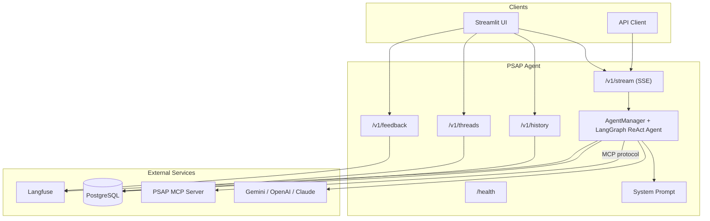

# PSAP Agent

[](https://www.python.org/downloads/)
[](https://opensource.org/licenses/Apache-2.0)

LangGraph-based AI agent for vLLM inference performance analysis. It supports Google Gemini by default, OpenAI models through the OpenAI API, and Anthropic Claude through Vertex AI. It connects to the [PSAP MCP Server](../psap-mcp-server/) to query benchmark data, analyze PyTorch profiler traces, compare vLLM versions, and generate Grafana dashboard links -- all through natural language.

## Architecture



The agent uses a LangGraph ReAct loop: the selected LLM decides which MCP tools to call based on the user's question, the MCP server executes them and returns structured data, and the LLM synthesizes the results into a response. Conversation state is checkpointed to PostgreSQL so users can resume threads across sessions.

## Curated Workflow Skills

The stable system prompt contains global integrity and confidentiality rules.
For specialized work, the agent loads reviewed on-demand workflows for
clarification and fair comparisons, benchmarks, cost, Grafana, profiling,
source analysis, logs, and vLLM performance triage. This keeps detailed
operating rules out of the always-on prompt while preserving them in versioned,
test-covered documents.

## API Endpoints

| Endpoint | Method | Description |
|---|---|---|
| `/health` | GET | Health check |
| `/v1/stream` | POST | Stream chat responses (SSE) |
| `/v1/history/{thread_id}` | GET | Get conversation history |
| `/v1/threads/{user_id}` | GET | List user threads |
| `/v1/feedback` | POST | Record feedback (sent to Langfuse) |

### Streaming Request

```http
POST /v1/stream
Content-Type: application/json
Accept: text/event-stream
```

```json
{
  "message": "Compare vLLM 0.13.0 vs 0.11.2 for DeepSeek on H200",
  "thread_id": "thread-123",
  "session_id": "session-456",
  "user_id": "user-789",
  "stream_tokens": true
}
```

### Streaming Response

```
{"type":"message","content":{"type":"ai","content":"","tool_calls":[...]}}
{"type":"token","content":"The"}
{"type":"token","content":" throughput"}
{"type":"message","content":{"type":"ai","content":"The throughput improved by 49%..."}}
[DONE]
```

## Configuration

Environment variables (see `.env.example`):

| Variable | Default | Description |
|---|---|---|
| `AGENT_HOST` | `0.0.0.0` | Server bind address |
| `AGENT_PORT` | `8081` | Server port |
| `MCP_SERVER_URL` | `http://localhost:5001/mcp/` | PSAP MCP Server endpoint |
| `USE_INMEMORY_SAVER` | `false` | Use in-memory storage instead of PostgreSQL |
| `POSTGRES_HOST` | `localhost` | PostgreSQL host |
| `POSTGRES_PORT` | `5432` | PostgreSQL port |
| `POSTGRES_DB` | `psap` | Database name |
| `POSTGRES_USER` | `psap_user` | Database user |
| `POSTGRES_PASSWORD` | -- | Database password |
| `GOOGLE_API_KEY` | -- | Google Gemini API key |
| `OPENAI_API_KEY` | -- | OpenAI API key |
| `OPENAI_MODEL` | -- | Optional additional OpenAI model ID exposed in the Streamlit selector |
| `LANGFUSE_PUBLIC_KEY` | -- | Langfuse public key |
| `LANGFUSE_SECRET_KEY` | -- | Langfuse secret key |
| `LANGFUSE_HOST` | -- | Langfuse server URL |
| `PYTHON_LOG_LEVEL` | `INFO` | Logging level |

To enable OpenAI in the Streamlit UI, set `OPENAI_API_KEY` in the ignored local
`.env`. The selector includes `gpt-6-luna` with extra-high (`xhigh`) thinking
and `gpt-6-sol` with medium thinking; `OPENAI_MODEL` optionally adds one more
model. API clients can select any configured OpenAI model with
`"model": "openai:<model-id>"` and may send `"reasoning_effort": "xhigh"`
or another supported value. The same model format also works for `CRITIC_MODEL`
and `LLM_JUDGE_MODEL`.

## Local Development

```bash
# Create virtual environment and install
uv venv && source .venv/bin/activate
uv pip install -e ".[dev]"

# Configure environment
cp .env.example .env
# Edit .env with your Google API key, Langfuse keys, etc.

# Run with in-memory storage (no PostgreSQL needed)
USE_INMEMORY_SAVER=true python -m psap_agent.src.main

# Or use the Makefile
make local
```

The agent expects the PSAP MCP Server to be running at `MCP_SERVER_URL`. If it is unavailable and `USE_INMEMORY_SAVER=true`, the agent starts without performance-data MCP tools but retains its local curated-skill loader.

## Testing

```bash
pytest                                          # Run all tests
pytest --cov=psap_agent.src --cov-report=html   # With coverage
pytest tests/test_prompt.py -v                  # Specific test file
pytest tests/test_legacy_policy_coverage.py -v  # Curated-policy regression checks
```

## Project Structure

```
psap-agent/
├── psap_agent/
│   ├── src/
│   │   ├── core/
│   │   │   ├── agent.py          # Agent initialization (LLM + MCP client + checkpointer)
│   │   │   ├── model_factory.py  # Gemini, OpenAI, and Claude model routing
│   │   │   ├── manager.py        # AgentManager: streaming, Langfuse tracing, event formatting
│   │   │   ├── prompt.py         # Stable global policy prompt
│   │   │   ├── curated_skills.py # Allowlisted on-demand workflow loader
│   │   │   ├── curated_skill_documents/ # Reviewed workflow documents
│   │   │   ├── storage.py        # Global in-memory checkpoint (dev mode)
│   │   │   ├── cache_manager.py  # Gemini context caching
│   │   │   └── agent_utils.py    # Message conversion utilities
│   │   ├── routes/
│   │   │   ├── stream.py         # SSE streaming endpoint
│   │   │   ├── health.py         # Health check
│   │   │   ├── history.py        # Conversation history
│   │   │   ├── threads.py        # Thread management
│   │   │   └── feedback.py       # Feedback to Langfuse
│   │   ├── api.py                # FastAPI app with lifespan
│   │   ├── main.py               # Entry point
│   │   ├── schema.py             # Request/response models
│   │   └── settings.py           # Pydantic settings
│   └── utils/
│       └── pylogger.py           # Structured logging
├── examples/
│   └── streamlit_app.py          # Streamlit chat UI
├── tests/
├── Containerfile                 # UBI9 Python 3.12 image
├── .env.example
└── pyproject.toml
```

## License

[Apache 2.0](LICENSE)
