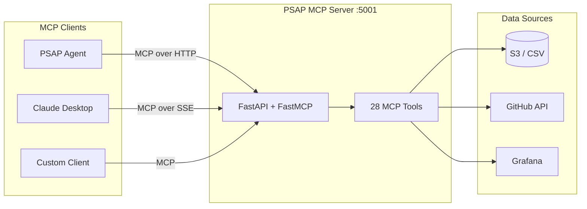

# PSAP MCP Server

[](https://www.python.org/downloads/)
[](https://opensource.org/licenses/Apache-2.0)

FastMCP server providing 28 performance analysis tools over the Model Context Protocol. Designed for the [PSAP Agent](../psap-agent/) but compatible with any MCP client (Claude Desktop, Cursor, custom agents). Tools query vLLM benchmark data from S3, analyze PyTorch profiler traces, fetch vLLM source code and diffs from GitHub, and generate Grafana dashboard links.

## Tool Catalog

| Category | Tools | Description |
|---|---|---|
| Benchmark Data | `query_performance_metrics`, `compare_configurations`, `compare_versions_comprehensive` | Query and compare throughput, latency, TTFT, ITL across models, accelerators, versions |
| Discovery | `get_dataset_metadata`, `discover_configurations` | Discover available models, accelerators, profiles, versions |
| Cost & Regression | `calculate_cost_efficiency`, `analyze_regression` | Cost-per-million-tokens and version-to-version regression detection |
| Grafana | `query_grafana_metrics`, `compare_grafana_metrics`, `generate_grafana_url` | Query GPU/vLLM metrics, compare runs, generate dashboard URLs |
| Dashboard | `generate_dashboard_url` | Generate links to the performance dashboard with pre-applied filters |
| PyTorch Profiler | `analyze_pytorch_profile`, `compare_pytorch_profiles`, `analyze_performance_insights`, `list_available_profiles`, `check_profile_status` | Parse Chrome trace JSON from S3, extract kernel stats, compare across versions with functional pipeline breakdowns |
| Kernel-to-Code | `map_kernel_to_vllm_code`, `get_kernel_categories`, `correlate_kernel_with_changes` | Map profiler kernel names to vLLM source files, correlate performance changes with code changes |
| vLLM Source | `fetch_vllm_source`, `get_vllm_code_diff` | Fetch vLLM source code at any version tag and line-level diffs between versions via GitHub API |
| vLLM Releases | `get_vllm_release_notes`, `compare_vllm_versions`, `get_version_mappings`, `get_vllm_pull_request` | Fetch release notes, compare changelogs, resolve version mappings, inspect PRs |
| vLLM Logs | `fetch_vllm_logs`, `compare_vllm_logs` | Fetch and compare vLLM server logs (engine config, compilation timings, memory allocation) between versions |
| Performance Triage | `get_vllm_performance_triage_guide` | Structured 5-step vLLM performance triage workflow and diagnostic guidance |

## Architecture



The server uses a tools-first architecture: all capabilities are exposed as MCP tools (no resources or prompts). Tools are registered in `PSAPMCPServer._register_mcp_tools()` and served via FastMCP with configurable transport (streamable-HTTP, SSE, or HTTP).

## Configuration

Environment variables (see `.env.example`):

| Variable | Default | Description |
|---|---|---|
| `MCP_HOST` | `0.0.0.0` | Server bind address |
| `MCP_PORT` | `5001` | Server port |
| `MCP_TRANSPORT_PROTOCOL` | `streamable-http` | Transport: `streamable-http`, `sse`, or `http` |
| `PYTHON_LOG_LEVEL` | `INFO` | Logging level |
| `S3_BUCKET` | -- | S3 bucket for benchmark data and profiler traces |
| `PROFILE_S3_PREFIX` | `pytorch-profiles/rhaiis` | S3 prefix for PyTorch profiler traces |
| `GRAFANA_URL` | -- | Grafana server URL |
| `GRAFANA_TOKEN` | -- | Grafana API token |
| `GITHUB_TOKEN` | -- | GitHub token (optional, for higher API rate limits) |
| `MCP_SSL_KEYFILE` | -- | SSL private key path |
| `MCP_SSL_CERTFILE` | -- | SSL certificate path |

## Local Development

```bash
# Create virtual environment and install
uv venv && source .venv/bin/activate
uv pip install -e ".[dev]"

# Configure environment
cp .env.example .env
# Edit .env with your S3, Grafana, and GitHub credentials

# Run the server
python -m psap_mcp_server.src.main

# Or use the Makefile
make local
```

### Verify

```bash
# Health check
curl http://localhost:5001/health

# List tools via MCP
curl -X POST http://localhost:5001/mcp \
  -H "Content-Type: application/json" \
  -d '{"jsonrpc":"2.0","id":1,"method":"tools/list"}'
```

## Data Sources

### Benchmark Data (S3 / CSV)

Performance metrics are loaded from S3 or a local `consolidated_dashboard.csv` fallback. The data includes throughput, latency, TTFT, ITL, and error rates across models, accelerators, vLLM versions, and concurrency levels.

### PyTorch Profiler Traces (S3)

Chrome trace JSON files are expected at:

```
s3://<bucket>/<PROFILE_S3_PREFIX>/<accelerator>/<model>/<tp>/<version>/<workload>/trace_rank<N>_*.json
```

The server auto-discovers available accelerators, models, TP configs, versions, and workloads by listing S3 prefixes.

### vLLM Source and Releases (GitHub API)

The `kernel_code_mapper_tool` and `vllm_release_notes_tool` fetch data directly from the [vllm-project/vllm](https://github.com/vllm-project/vllm) GitHub repository. An optional `GITHUB_TOKEN` increases API rate limits.

## Testing

```bash
pytest                                                # Run all tests
pytest --cov=psap_mcp_server --cov-report=html        # With coverage
pytest tests/test_mcp.py -v                           # Specific test file
```

## Project Structure

```
psap-mcp-server/
├── psap_mcp_server/
│   ├── src/
│   │   ├── mcp.py                          # PSAPMCPServer class, tool registration
│   │   ├── api.py                          # FastAPI app, health endpoint, transport setup
│   │   ├── main.py                         # Entry point
│   │   ├── settings.py                     # Pydantic settings
│   │   ├── tools/
│   │   │   ├── query_performance_tool.py   # Benchmark data queries
│   │   │   ├── compare_performance_tool.py # Version and config comparison
│   │   │   ├── cost_efficiency_tool.py     # Cost per million tokens
│   │   │   ├── regression_analysis_tool.py # Regression detection
│   │   │   ├── dataset_metadata_tool.py    # Dataset discovery
│   │   │   ├── discover_configurations_tool.py
│   │   │   ├── grafana_metrics_tool.py     # Grafana GPU metrics
│   │   │   ├── compare_grafana_metrics_tool.py
│   │   │   ├── generate_dashboard_url_tool.py
│   │   │   ├── generate_grafana_url_tool.py
│   │   │   ├── vllm_release_notes_tool.py  # Release notes, PRs, version mappings
│   │   │   ├── pytorch_profile_tool.py     # Profiler trace analysis
│   │   │   ├── kernel_code_mapper_tool.py  # Kernel-to-source mapping, GitHub code/diff
│   │   │   ├── vllm_log_tool.py            # vLLM server log fetching and comparison
│   │   │   ├── vllm_performance_triage_tool.py # 5-step performance triage guide
│   │   │   ├── performance_data_loader.py  # S3/CSV data loading
│   │   │   └── s3_utils.py                 # S3 client helper
│   │   ├── oauth/                          # OAuth2 support
│   │   └── storage/                        # PostgreSQL storage (for OAuth)
│   └── utils/
│       └── pylogger.py                     # Structured logging
├── tests/
├── Containerfile                           # UBI9 Python 3.12 image
├── .env.example
└── pyproject.toml
```

## Adding a New Tool

1. Create `psap_mcp_server/src/tools/your_tool.py` with a function returning `Dict[str, Any]`
2. Import and register it in `psap_mcp_server/src/mcp.py`:
   ```python
   from psap_mcp_server.src.tools.your_tool import your_function
   # In _register_mcp_tools():
   self.mcp.tool()(your_function)
   ```
3. Add tests in `tests/`

## License

[Apache 2.0](LICENSE)
